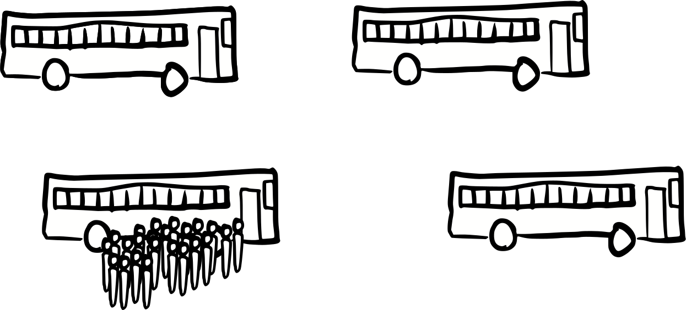

---
title: English quantifiers -- Bus example
...

What does the statement "everyone can fit in a bus" mean?

# Partition

Everyone can fit in a bus by dividing people between buses

This is formalized in mathematics as a partition problem:
given a set of buses and a set of people,
find a mapping between people and buses that satisfied capacity constraints.

# As a set, universal

Everyone can fit in a bus, so we only need one bus.

This is formalized in mathematics by saying the "fit in a bus" predicate applies to an entire set of people rather than to individual people.

# One at a time, universal

Everyone can fit in a bus, even the largest person in the world.

This is formalized in mathematics by saying the "fit in a bus" predicate applies to any person we happen to pick, but individually instead of as a group.

# As a set, existential

Everyone can fit in a bus, so we only need one bus if we get the biggest bus.

# One at a time, existential

Everyone can fit in a bus; even the largest person in the world can fit on a big bus

